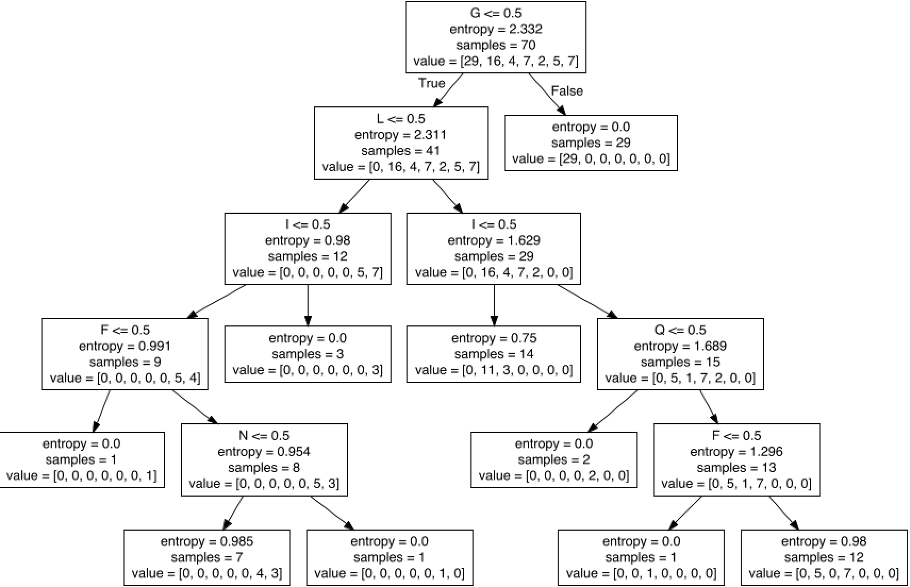
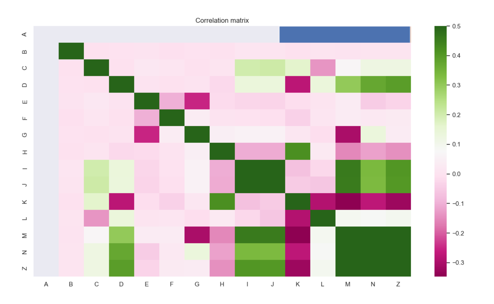

### Vitse Maxime M1 I2L

Objectif : apprendre la colonne Z

## How to run code?

Using python

Click right on the file and select `Run` on Pycharm ;-)

## Explications/choix

### Analyze data : 

Champ : dataCCfinal_1 / dataCCfinal_2

    Nombre d'exemples : 101 / 17 379

    Nombre de caractéristiques descriptives : 25 / 14

    Nombre d'exemples de chaque classe : 101 / 17 379


### Matrice de corélation - dataCCfinal_1 - Cas de classification

    Suppresion des colonnes A, B et C pour générer la matrice de corrélation
    A et B ont des valeurs fixes
    C sont des strings


Les champs qui ont une corrélation faibles ou fortes sont : 
F, G, I, L, N, Q

Avec les annotations à true , on peut confirmer plus facilement
Donc >0.2 et > -0.6


### Algorithmes - dataCCfinal_1
- K voisins avec  F, G, I, L, N, Q et Z
    
```
KNeighborsClassifier
Train score :  0.7428571428571429
Test score :  0.5806451612903226
[[14  0  0  1  0  0  0]
 [ 0  0  6  3  0  0  0]
 [ 0  1  0  0  0  0  0]
  0  0  0  2  0  0  0]
 [ 0  0  0  2  0  0  0]
 [ 0  0  0  0  0  1  0]
 [ 0  0  0  0  0  0  1]]
 ```

- Arbre de décisions avec  F, G, I, L, N, Q

```
TreeClassifier
Train score :  0.7857142857142857
Test score :  0.8387096774193549
[[10  0  0  0  0  0]
 [ 0  4  0  0  0  0]
 [ 0  0  6  0  0  0]
 [ 0  0  0  1  0  0]
 [ 0  0  0  0  0  5]
 [ 0  0  0  0  0  5]]
```



- Réseaux de neuronnes avec  F, G, I, L, N, Q et Z

```
NeuralNetwork
Train score: 0.8571428571428571
Test score 0.7741935483870968
[[12  0  0  0  0  0  0]
 [ 0  5  0  2  0  0  0]
 [ 0  2  0  1  0  0  0]
 [ 0  0  0  5  0  0  0]
 [ 0  0  0  1  0  0  1]
 [ 0  0  0  0  0  2  0]
 [ 0  0  0  0  0  0  0]]
```

### Si on chosiit de prendre les valeurs les plus corélés à Z : ['F', 'I', 'N', 'O', 'P']
Nous aurons des meilleurs scores :

```
KNeighborsClassifier
Train score :  0.8285714285714286
Test score :  0.8709677419354839
[[13  0  0  1  0  0  0]
 [ 0  5  0  0  0  0  0]
 [ 0  0  1  0  0  0  0]
 [ 0  0  0  3  0  0  0]
 [ 0  0  0  0  1  0  0]
 [ 0  0  0  0  0  3  0]
 [ 0  0  0  2  1  0  1]]
 
TreeClassifier
Train score :  0.9714285714285714
Test score :  0.9354838709677419
[[14  0  0  0  0  0  0]
 [ 0  5  0  0  0  0  0]
 [ 0  0  0  0  0  0  1]
 [ 0  0  0  3  0  0  0]
 [ 0  0  0  0  1  0  0]
 [ 0  0  0  0  0  3  0]
 [ 0  0  0  0  1  0  3]]
 
NeuralNetwork
Train score: 0.8571428571428571
Test score 0.8709677419354839
[[14  0  0  0  0  0  0]
 [ 0  5  0  0  0  0  0]
 [ 0  0  1  0  0  0  0]
 [ 0  0  0  3  0  0  0]
 [ 0  0  0  0  0  0  1]
 [ 0  0  0  0  0  3  0]
 [ 0  2  1  0  0  0  1]]
```

    Quand le Train score > Test score => il y a surapprentissage
    Donc garder les colonnes ['F', 'I', 'N', 'O', 'P'] est mieux pour le NeuralNetwork et pour KNeighborsClassifier
    mais pour TreeClassifier, il y a un surapprentissage
    Avec ['F', 'G', 'I', 'L', 'N', 'Q'], ce n'est pas le cas

    Le plus performant est TreeClassifier -> NeuralNetwork -> KNeighborsClassifier

### Matrice de corélation - dataCCfinal_2 - Cas de régression



Les colonnes le plus en coorélation avec Z sont : D,I,J,M,N

```
KNeighborsRegressor
Coefficient of determination: 0.9997814838189416
MAE: 1.1513233601841193
MSE: 7.122032988108934
MAE (training): 0.9413399095766538
MSE (training): 3.628103575832304

TreeRegressor
Coefficient of determination: 0.9833782285283071
MAE: 15.681897559640811
MSE: 541.7484607722189
MAE (training): 14.717368275690667
MSE (training): 479.0517767122878

NeuralNetworkRegressor
Coefficient of determination: 0.9999998230723951
MAE: 0.05010888487033955
MSE: 0.00576654887790031
MAE (training): 0.049970732655157224
MSE (training): 0.005360224208057769
```