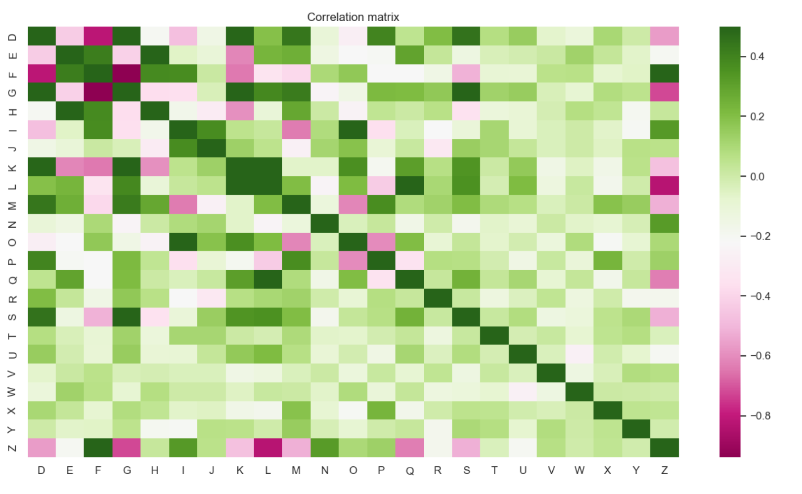
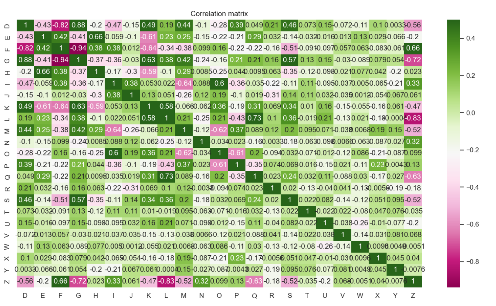

### Vitse Maxime M1 I2L

Objectif : apprendre la colonne Z

# How to run code?

# Explications/choix

## Analyze data : 

Champs : dataCCfinal_1 / dataCCfinal_2

    Nombre d'exemples : 101 / 17 379

    Nombre de caractéristiques descriptives : 25 / 14

    Nombre d'exemples de chaque classe : 101 / 17 379 mais 0 classes car on est en régression

Régression : classement sur des valeurs numériques

Matrice de corélation - dataCCfinal_1

    Suppresion des colonnes A, B et C pour générer la matrice de corrélation
    A et B ont des valeurs fixes
    C sont des strings

Les champs qui ont une corrélation faibles ou fortes sont : 
F, G, I, L, N, Q

Avec les annotations à true , on peut confirmer plus facilement
Donc >0.2 et > -0.6

Matrice de corélation - dataCCfinal_2

# Commentaires codes